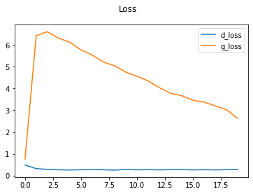

# FashionGAN: A Generative Adversarial Network for Fashion Image Generation

This repository demonstrates a simple implementation of a Generative Adversarial Network (GAN) using TensorFlow and Keras to generate fashion images from the Fashion MNIST dataset.

## Requirements
```bash
pip install tensorflow matplotlib tensorflow-datasets
```

## Overview

This project uses a Generative Adversarial Network (GAN) to generate synthetic fashion images based on the Fashion MNIST dataset. The network consists of two main components:

- **Generator:** Takes a random latent vector (noise) as input and generates synthetic fashion images.
- **Discriminator:** Takes both real and generated images as input and classifies them as real or fake.

The training process involves the generator trying to create realistic images that can fool the discriminator, while the discriminator tries to correctly classify real vs fake images. The goal is for the generator to produce realistic images and for the discriminator to accurately distinguish between them.

## Dataset

This project uses the **Fashion MNIST** dataset, which contains 60,000 28x28 grayscale images of 10 fashion categories, including t-shirts, trousers, dresses, etc.

The dataset is accessed using `tensorflow_datasets` and preprocessed by scaling the images and batching them into manageable sizes.

## Results
The images below show the progress of the generator in creating fashion images throughout the training process. These images were generated by the model during the training epochs and saved using the ModelMonitor callback.

Generated Images


Loss Curves
The following plot shows the loss curves for both the generator and discriminator during the training process.


## Running the Code

To train the model, simply run all the cells, and the images generated during training will be saved in an `images/` directory.
